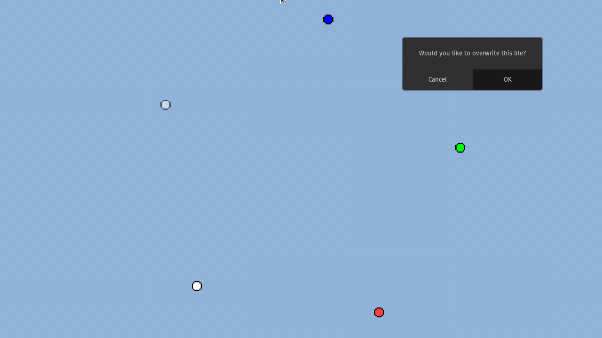

# Mgine 
Mgine is a 2D Game engine based on SDL2 libraries. It was made mostly for educational purposes. It's internal workings are 
designed on-the-go, with no prior knowleage of how game engines work. There may be some reseamblance to Monogame (formerly known as XNA), 
which is a C# game development framework that the author have had used for some nonsense projects in the past.



## Dependencies
```
sudo apt install libsdl2-dev libsdl2-2.0-0 libsdl2-image-dev libsdl2-ttf-dev -u
sudo apt-get install build-essential gdb
```

## Building 
```
mkdir build
cd build
cmake ..
make
make install
```